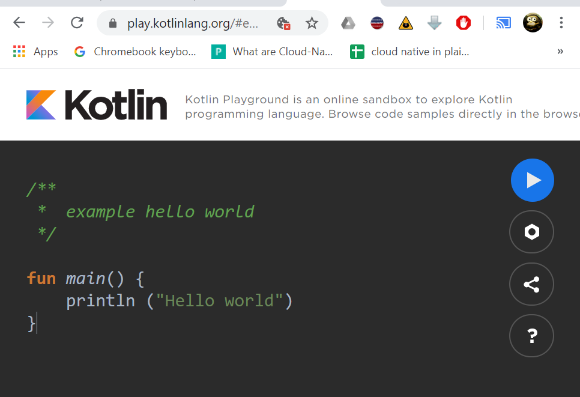

# kotlin samples
These code samples are non-android mostly examples of various language components.

NOTE: There are two ways to run these samples:
1.  Install kotlin & java 
2.  Ue kotlin playground 
to install kotlin and java to compile and run these samples.
## Istalled (kotlin & java) Example of how to compile and run
kotlin code contained in  stringSample.kt
### compile step
```bash
kotlinc stringSample.kt -include-runtime -d stringSample.jar
```
### run the jar
```bash
java -jar stringSample.jar
```
## Use kotlin playground
https://play.kotlinlang.org/

